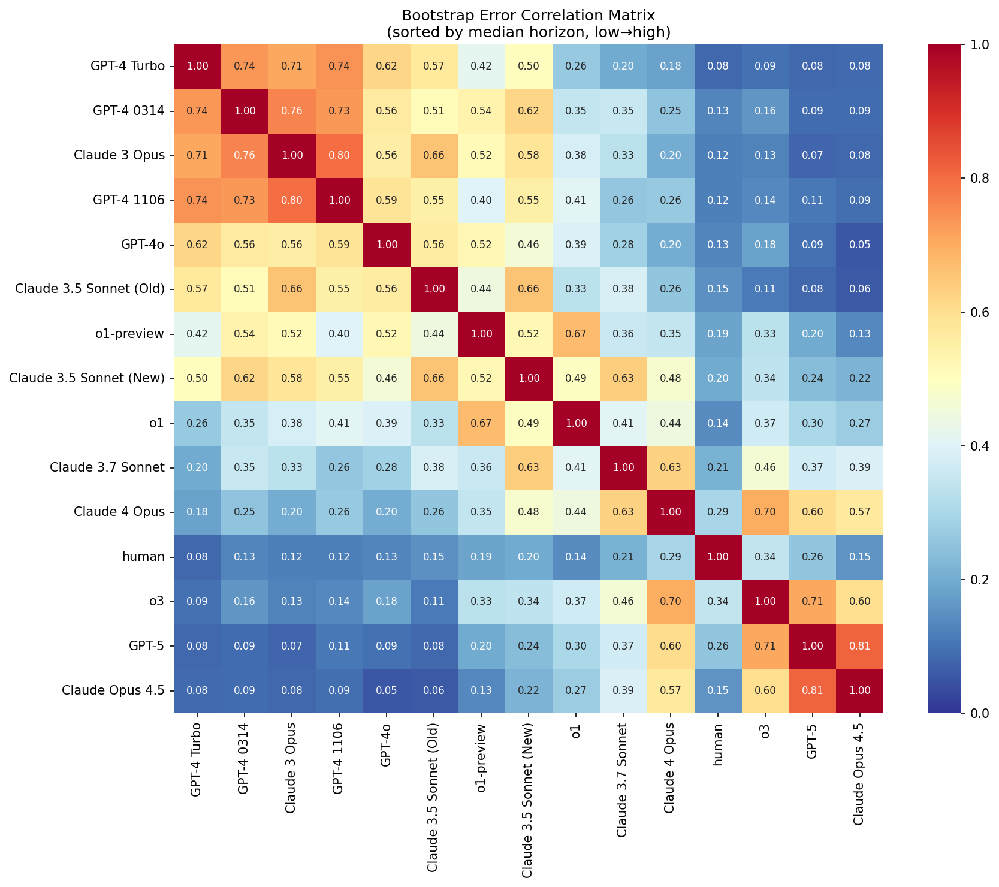

# Bootstrap Distribution Analysis for METR Time Horizon Estimates

This document analyzes the shape of bootstrap distributions for p50 time horizon estimates from the METR Time Horizon 1.1 benchmark. The goal is to inform the choice of measurement error likelihood in downstream Bayesian models.

## Executive Summary

| Finding | Implication |
|---------|-------------|
| **Log-normal fits best** for all 15 models | Use log-normal (Gaussian in log space) for measurement error |
| **Log-space asymmetry is small** for most models | Symmetric Gaussian in log space is adequate for 12/15 models |
| **Frontier models have residual skew** in log space | GPT-5, Opus 4.5, o3 may need special handling |
| **Bootstrap errors are correlated** across models | Trend slope uncertainty requires joint treatment |
| **Point estimates ≈ bootstrap medians** | Within ±2% for all models |
| **No heteroskedasticity** | Single σ_meas works across all models |

## 1. How the Plots Work

### What the dots represent
The dots on METR's headline plots show **point estimates** from logistic regression on the full dataset:
- Fit: `P(success) = logistic(slope × log₂(time) + intercept)`
- Point estimate: solve for time where `P(success) = 0.5`

### What the error bars represent
The error bars show **95% bootstrap confidence intervals**:
- 1000 bootstrap iterations with hierarchical resampling over task families → task IDs → runs
- Lower bound: 2.5th percentile of bootstrap distribution
- Upper bound: 97.5th percentile of bootstrap distribution

## 2. Distribution Shape Analysis

We ran 1000 bootstrap iterations and analyzed the resulting distributions for each model.

### 2.1 Raw Scale: Heavily Right-Skewed

On the raw (minutes) scale, all bootstrap distributions are heavily right-skewed:

| Model | Median | Skewness | Kurtosis |
|-------|--------|----------|----------|
| GPT-4 0314 | 3.5 | 1.44 | 3.56 |
| Claude 3.5 Sonnet (New) | 19.6 | 1.29 | 2.34 |
| o3 | 119.8 | 2.28 | 9.76 |
| GPT-5 | 209.6 | 18.43 | 428.56 |
| Claude Opus 4.5 | 317.8 | 31.16 | 977.20 |

**Conclusion**: Normal distribution on raw scale is inappropriate for all models.

### 2.2 Log Scale: Much Better, But Not Perfect

After log transformation, distributions are closer to normal:

| Model | Log Skewness | Shapiro p-value | Log-space CI Ratio |
|-------|--------------|-----------------|-------------------|
| GPT-4 0314 | -0.14 | 0.26 | 1.03 (symmetric) |
| Claude 3.5 Sonnet (New) | -0.16 | 0.20 | 1.06 (symmetric) |
| o1-preview | -0.14 | 0.10 | 1.08 (symmetric) |
| Claude 3.7 Sonnet | -0.24 | 0.008 | 1.14 (slight) |
| o3 | **0.36** | 0.000 | 0.80 (asymmetric) |
| GPT-5 | **1.15** | 0.000 | 0.62 (asymmetric) |
| Claude Opus 4.5 | **1.59** | 0.000 | 0.56 (asymmetric) |

**Log-space CI Ratio** = (median - q2.5) / (q97.5 - median)
- Ratio = 1.0: symmetric (dot centered on log-scale plot)
- Ratio < 1.0: upper error bar longer (dot below center)
- Ratio > 1.0: lower error bar longer (dot above center)

### 2.3 Distribution Fit Comparison

Using Kolmogorov-Smirnov tests, **log-normal fits best for all 15 models**:

| Distribution | Models where best fit |
|--------------|----------------------|
| Log-normal | 15/15 |
| Normal | 0/15 |
| Gamma | 0/15 |

## 3. Point Estimate vs Bootstrap Median

The point estimate (from full-data logistic regression) closely matches the bootstrap median:

| Model | Point Est | Median | Difference |
|-------|-----------|--------|------------|
| GPT-4 0314 | 3.5 | 3.5 | +1.0% |
| Claude 3.5 Sonnet (New) | 19.8 | 19.6 | +1.1% |
| o3 | 120.7 | 119.8 | +0.8% |
| Claude Opus 4.5 | 320.4 | 317.8 | +0.8% |

**All models within ±3%** — point estimates are unbiased relative to bootstrap.

## 4. Correlated Errors Across Models

### 4.1 The Mechanism

The bootstrap resamples **tasks**, not models. Within each bootstrap iteration:
1. Task families are resampled (shared across all models)
2. Task IDs within families are resampled (shared across all models)
3. Runs within (task, model) pairs are resampled (independent per model)

Since steps 1-2 are shared, when a bootstrap iteration over-samples "easy" tasks, **all models benefit simultaneously**.

### 4.2 Key Finding: Correlation Driven by Capability Similarity, NOT Lab

The correlation structure has a clear pattern:

| Metric | Value |
|--------|-------|
| Correlation with \|log(h₁) - log(h₂)\| | **r = -0.82** |
| Within same lab | mean r = 0.39 |
| Between different labs | mean r = 0.34 |
| Within capability tier | mean r = 0.58 |
| Cross capability tiers | mean r = 0.30 |

**The correlation is entirely explained by capability similarity**, not lab identity. Models at similar capability levels have similar "decision boundaries" — tasks they sometimes pass, sometimes fail. They're affected by the same task resampling, so their errors are correlated.

### 4.3 Correlation Matrix



The block-diagonal structure (when sorted by horizon) shows that correlation clusters by capability tier:
- **Low-capability cluster** (GPT-4 variants, Claude 3 Opus): r ≈ 0.7-0.8
- **Mid-capability cluster** (Sonnet 3.5, o1-preview): r ≈ 0.5-0.7
- **Frontier cluster** (o3, GPT-5, Opus 4.5): r ≈ 0.6-0.8

### 4.4 Highest and Lowest Correlations

**Highest** (similar capability):
| Pair | Correlation |
|------|-------------|
| Claude Opus 4.5 ↔ GPT-5 | 0.81 |
| Claude 3 Opus ↔ GPT-4 1106 | 0.80 |
| Claude 3 Opus ↔ GPT-4 0314 | 0.77 |

**Lowest** (different capability):
| Pair | Correlation |
|------|-------------|
| Claude Opus 4.5 ↔ GPT-4o | 0.05 |
| Claude 3.5 Sonnet (Old) ↔ Claude Opus 4.5 | 0.06 |
| Claude 3 Opus ↔ GPT-5 | 0.07 |

**42% of bootstrap iterations** have ≥12/15 models on the same side of their medians (vs 7% expected under independence).

### 4.3 Implications for Trend Fitting

The METR codebase **correctly handles** this correlation by fitting trendlines **within** each bootstrap sample:

```python
for sample_idx in range(n_bootstraps):
    # Get ALL agents' p50s from THIS bootstrap sample (correlated)
    p50s = [bootstrap_results[f"{agent}_p50"].iloc[sample_idx] for agent in agents]

    # Fit trendline to these correlated values
    doubling_time = fit_trendline(p50s, dates)
    doubling_times.append(doubling_time)

# CI from distribution of trendlines
ci = np.percentile(doubling_times, [2.5, 97.5])
```

This "bootstrap the whole analysis" approach correctly propagates correlated errors.

**For external Bayesian models**: If you treat measurement errors as independent, you will **underestimate** uncertainty on trend parameters.

## 5. Heteroskedasticity

**Not present.** Correlation between log(median) and CI width = 0.049.

The measurement uncertainty (in log space) is roughly constant (~1.5–2.1 log-units) regardless of horizon magnitude. A single σ_meas works for all models.

## 6. Recommendations for Bayesian Models

### 6.1 Measurement Error Distribution

**Use log-normal** (equivalently, Gaussian in log space):

```
log(y_observed) ~ Normal(log(z_true), σ_meas)
```

This is:
- Correct for 12/15 models (log-space Shapiro p > 0.05)
- Approximately correct for the remaining 3 frontier models
- Much better than symmetric Gaussian on raw scale

### 6.2 Parameterizing σ_meas from CIs

```python
sigma_meas = (log(q975) - log(q025)) / 3.92  # 3.92 = 2 × 1.96
```

### 6.3 Handling Frontier Model Asymmetry

For GPT-5, Claude Opus 4.5, and o3, even log-normal is imperfect. Options:

1. **Accept misspecification** — if intrinsic scatter dominates, this may not matter
2. **Use split-normal in log space** — parameterize σ_lower and σ_upper separately
3. **Use bootstrap samples directly** — treat measurement uncertainty as discrete mixture

### 6.4 Handling Correlated Errors

Options for trend fitting:

1. **Bootstrap the whole analysis** (like METR does) — fit your Bayesian model 1000 times, once per bootstrap sample
2. **Model correlation explicitly** — use multivariate normal with empirical correlation matrix
3. **Ignore** — if intrinsic scatter is large, correlation in measurement error may be negligible

## 7. Files Generated

| File | Description |
|------|-------------|
| `bootstrap_samples.csv` | 1000 × 15 matrix of bootstrap p50 values |
| `bootstrap_distributions.png` | Distribution shapes with fitted parametric curves |
| `bootstrap_asymmetry.png` | Asymmetry and skewness patterns |
| `point_estimate_vs_median.png` | Point estimate vs bootstrap median comparison |
| `analyze_bootstrap_shapes.py` | Main analysis script |
| `plot_bootstrap_distributions.py` | Visualization script |

## 8. Key Takeaways

1. **Log-normal is the right choice** for measurement error — it fits all models and captures the essential asymmetry

2. **Symmetric Gaussian in log space is usually fine** — only 3 frontier models have notable residual skew

3. **Errors are correlated across models** — the METR code handles this correctly; external models should too

4. **Point estimates are trustworthy** — they match bootstrap medians within ±2%

5. **No need for heteroskedastic models** — CI width doesn't depend on horizon magnitude
