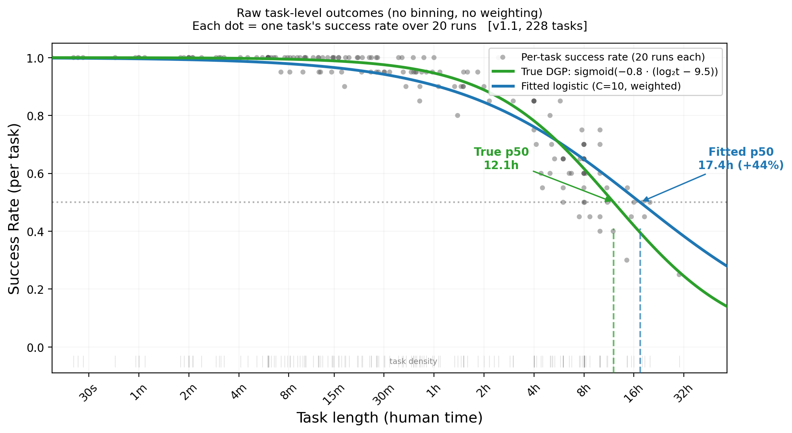
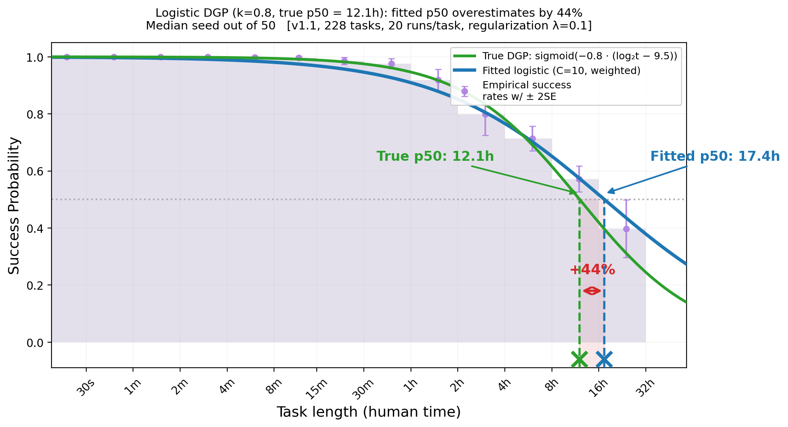
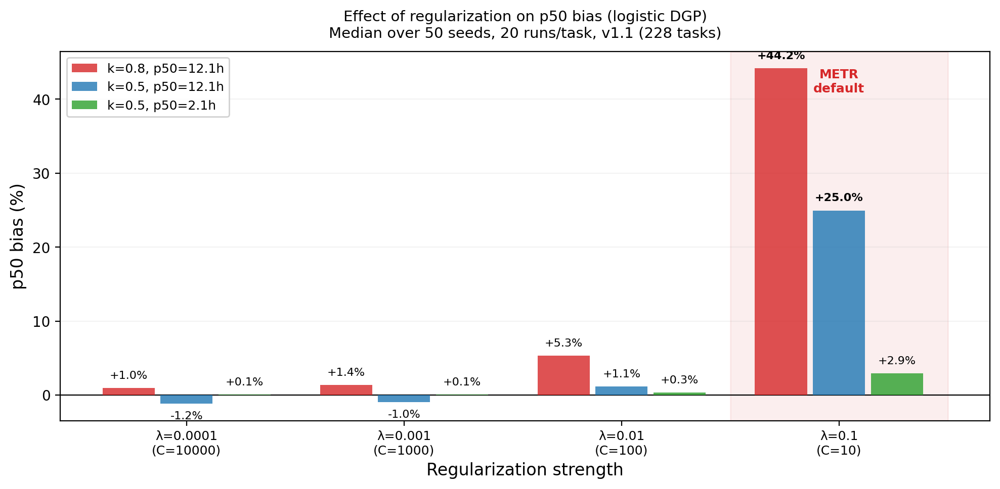
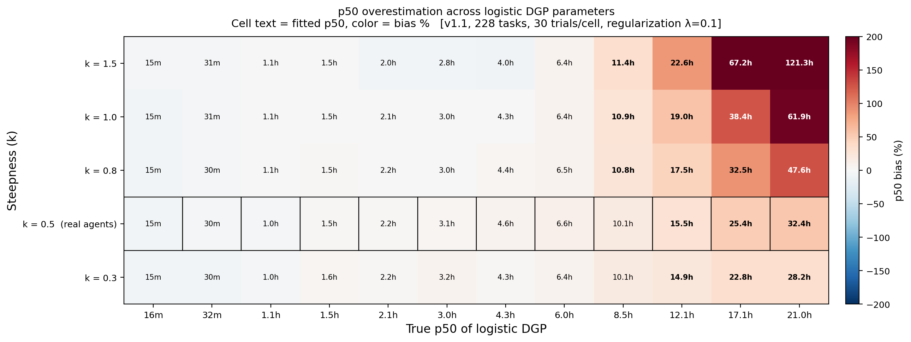

# METR's Logistic Fit Systematically Overestimates p50 for Strong Agents

## Background

METR's time horizon benchmark fits a logistic regression of binary task outcomes on log₂(human_minutes), then reads off the p50 — the task length at which the fitted curve crosses 50% success. METR's [Megan Kinniment](https://x.com/mkinniment/status/2025060520689369187) has noted that this procedure may overestimate the p50, because the fit "falls off too gently at the long end" and there are "much fewer tasks at the top end, so the fit doesn't focus on them as much."

We investigate this with synthetic experiments that isolate the mechanism.

## Setup

Instead of running a real agent on METR's tasks, we create a **synthetic agent** whose true success probability on each task is known exactly. We choose a logistic function for this: `P(success) = sigmoid(-k * (log2(t) - c))`, where `t` is the task's human_minutes. This gives us a known ground-truth p50 of 2^c minutes — something we can never know for a real agent.

For each task in METR's v1.1 task list (228 tasks), we flip coins according to this probability to generate 20 synthetic pass/fail outcomes. We then feed these outcomes through METR's actual fitting code — same logistic regression, same task weighting, same everything — and check whether the procedure recovers the p50 we know to be true.

Crucially, the true data-generating process is itself a logistic — the exact functional form METR's fit assumes. This means any bias in the recovered p50 is attributable to the fitting procedure (regularization, weighting, task distribution), not model misspecification.

- **Task scaffold**: The actual v1.1 task list (228 tasks with real `human_minutes` and `task_family`)
- **Fitting code**: METR's own `logistic_regression`, `get_x_for_quantile`, and `compute_sample_weights`
- **DGP**: `P(success) = sigmoid(-k * (log2(t) - c))`, with known true p50 = 2^c
- **Outcomes**: 20 synthetic binary outcomes per task, sampled from the DGP

## The Problem

With DGP parameters k=0.8, c=9.5 (true p50 = 12.1h), the procedure returns a median p50 of 17.4h across 50 random seeds — a **+44% overestimate**.

The scatter below plots each task's empirical success rate (successes out of 20 runs) against its human_minutes, with no binning or weighting:



The scatter is noisy — individual tasks have high variance at 20 runs each — but the fitted curve (blue) is visibly shifted rightward relative to the true DGP (green). The rug along the bottom shows that task density drops off sharply beyond ~4h, so the fit is crossing 0.5 in near-empty territory. The next section identifies the mechanism behind this shift.

For comparison, the same data plotted with METR's binning and weighting conventions:



The binning smooths over per-task noise but also over the sparse right tail, making the rightward shift harder to see.

## The Cause: Regularization Meets Sparse Tails

The inflation is an interaction between two factors. Neither alone is sufficient.



| DGP | reg=0.0001 (C=10000) | reg=0.01 (C=100) | **reg=0.1 (C=10, METR default)** |
|-----|-----|------|------|
| k=0.8, p50=12.1h | +1.0% | +5.3% | **+44.2%** |
| k=0.5, p50=12.1h | -1.2% | +1.1% | **+25.0%** |
| k=0.5, p50=2.1h | +0.1% | +0.3% | +2.9% |

**L2 regularization shrinks the slope toward zero.** METR uses `C=10` (λ=0.1). The regularization penalty makes the fitted logistic shallower than the true curve, which shifts p50 rightward since p50 = −intercept/coef in log-space.

**The task distribution determines how much data pushes back.** When the true p50 is at 2h — surrounded by dense data — the likelihood term overwhelms the regularization penalty and the fit is essentially correct (+2.9%). When the true p50 is at 12h and the 0.5 crossing falls in sparse territory, there's not enough data to counteract the slope shrinkage, and inflation reaches +25% to +44%.

This parallels the situation for strong agents. Under a logistic DGP, a model with a true p50 well beyond the bulk of the task distribution would see the same interaction: regularization flattens the slope, sparse data at the long end can't correct it, and the fitted p50 lands to the right of the truth.

**Neither factor alone causes large inflation:**
- Regularization with dense data → small bias (the p50=2.1h row: +2.9%)
- Sparse tails without regularization → small bias (the reg=0.0001 column: ~1%)
- Both together → +25% to +44%

## Robustness Across DGP Parameters

The inflation is not specific to one choice of (k, c). Sweeping across 12 true-p50 values and 5 steepness values, with 30 trials per cell:



- **Inflation grows with true p50.** Short-horizon agents (p50 < 1h) are approximately unbiased because the 0.5 crossing falls within the dense part of the task distribution. Long-horizon agents (p50 > 4h) are inflated because the crossing is in sparse territory where regularization dominates.
- **Steeper slopes inflate more.** Higher k means a faster drop in success rate, but regularization penalizes large coefficients more, so the fitted slope falls further short of the true slope.
- **The real agent parameter range (k ≈ 0.41–0.59, outlined cells) sits in the inflation zone for long-horizon agents.** For agents with true p50 in the 4–16h range and realistic slopes, the typical inflation is +20% to +80%.

## Caveats

- **This experiment uses a logistic DGP.** Real agents' success curves may not be logistic-shaped. If the true curve is steeper than a logistic, the interaction with regularization could produce different inflation magnitudes.
- **The relative ordering of agents is probably less affected than absolute p50 values**, since the bias direction is consistent across agents with similar parameters.
- **Reducing regularization is not a free lunch.** Less regularization means more variance (noisier estimates across seeds). Whether the current setting of λ=0.1 represents the right bias-variance tradeoff for long-horizon agents is a judgment call, but the +44% systematic bias at the default setting is worth weighing against the variance reduction it provides.

## Reproducing

```bash
python experiments/inflation_figures.py
```

Output figures are saved to `experiments/figures/`.
